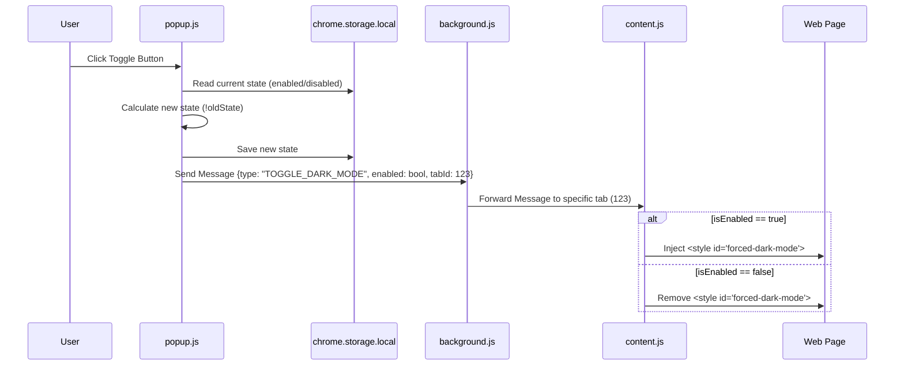

# Architecture & Technical Details

This document provides a deep dive into the technical implementation of the Force Dark Mode extension.

## System Overview

The extension uses a standard Chrome Extension MV3 (Manifest V3) architecture. It relies on the interaction between three main contexts:

1.  **Popup Context**: The UI presented to the user.
2.  **Background Context**: The service worker that acts as a bridge.
3.  **Content Context**: The script running inside the user's web page.

## Data Flow

When the user clicks the toggle button, the following sequence occurs:

## Component Details

### 1. Popup (`popup.js` & `popup.html`)
-   **Responsibility**: User Interface and State Persistence.
-   **State Management**: Uses `chrome.storage.local` to persist the toggle state *per tab*.
    -   Key Format: `darkMode_{tabId}`
    -   Value: `boolean`
-   **Logic**:
    -   On `DOMContentLoaded`: Queries the active tab, generates the storage key, and retrieves the saved state to update the button text.
    -   On `click`: Toggles the state, updates storage, and sends a message to the background script.

### 2. Background Service Worker (`background.js`)
-   **Responsibility**: Message Routing.
-   **Why is it needed?**
    -   In MV3, direct communication between Popup and Content script is possible but routing via Background is a robust pattern for decoupling, especially if we later add context menu toggles or keyboard shortcuts.
-   **Logic**: Listens for `TOGGLE_DARK_MODE` and calls `chrome.tabs.sendMessage` to the `tabId` specified in the payload.

### 3. Content Script (`content.js`)
-   **Responsibility**: DOM Manipulation.
-   **Isolation**: Runs in an isolated world, meaning it cannot access the page's window variables but can modify the DOM.
-   **CSS Strategy**:
    -   Uses `!important` to override existing styles.
    -   Sets `html` background to `#1e1e1e` (Dark Gray).
    -   Sets `color` (Text) to `#e0e0e0` (Light Gray).
    -   Forces all other elements to have `background-color: transparent` to let the dark body background show through, or overrides them with dark borders.

## Permissions Explained

-   **`storage`**: Required to remember if the user turned dark mode on/off for a specific tab so the popup button reflects reality when re-opened.
-   **`activeTab`**: Grants temporary access to the currently active tab when the user invokes the extension (clicks the icon). This allows us to send messages to that tab without requesting the scary "Read and change all your data on all websites" permission for everything.
-   **`scripting`**: (Technically unused in the current message-based version, but often required for `executeScript` if we switched strategies. Kept for future-proofing or removal if optimization is needed).

## Future Improvements
-   **Global Toggle**: Add a switch to enable dark mode for *all* sites by default.
-   **Custom Colors**: Allow users to pick their own background/text colors via the popup.
-   **Persist Across Reloads**: Currently, the content script does not auto-run on reload unless we add a check in `content.js` to read from storage on initialization.
