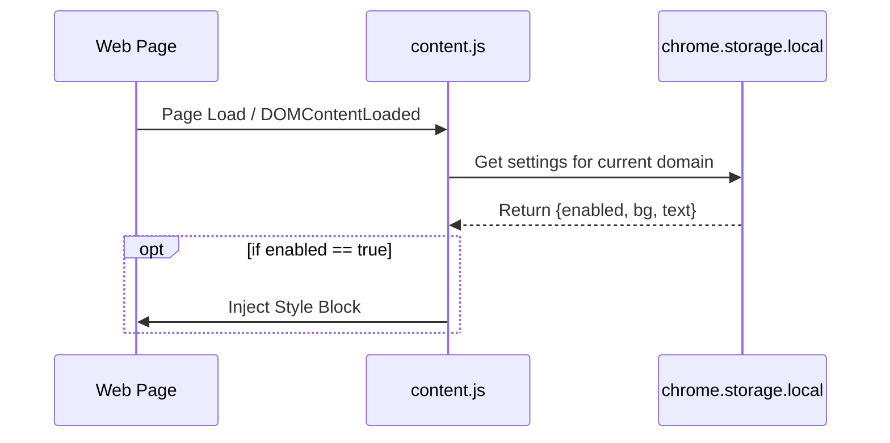
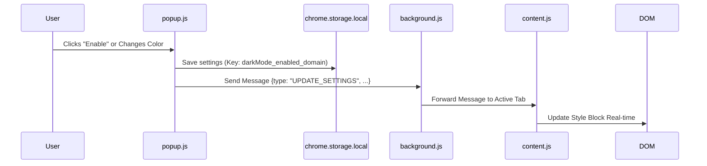

# Architecture & Technical Details

This document provides a deep dive into the technical implementation of the Force Dark Mode extension.

## System Overview

The extension uses a standard Chrome Extension MV3 (Manifest V3) architecture. The codebase is organized into a modular `src/` directory structure for maintainability.

### Directory Structure

```text
root/
├── src/
│   ├── assets/       # Static assets (images, fonts)
│   ├── background/   # Service worker script
│   ├── content/      # Content scripts (page injection)
│   ├── popup/        # UI logic and HTML
│   └── icons/        # Extension icons
└── manifest.json     # Configuration
```

## Data Flow & Persistence

One of the key features is **Domain-Based Persistence**. Settings are saved based on the website's hostname (e.g., `google.com`), ensuring that if a user enables Dark Mode on one tab, it applies to all tabs for that site and persists across reloads.

### Initialization (Page Load)


### Runtime Updates (User Interaction)


## Component Details

### 1. Popup (`src/popup/`)
-   **Files**: `popup.html`, `popup.js`
-   **Responsibility**: User Interface for configuration.
-   **Features**:
    -   **Theme Cards**: Pre-defined color sets (Classic, Midnight, OLED).
    -   **Color Pickers**: Custom input for Background and Text colors.
    -   **Palette Swatches**: Quick selection of popular colors.
-   **Logic**:
    -   Derives the current `domain` from the active tab.
    -   Reads/Writes to `chrome.storage.local` using domain-specific keys: `darkMode_enabled_google.com`.

### 2. Background Service Worker (`src/background/`)
-   **File**: `background.js`
-   **Responsibility**: Event coordination and Message Routing.
-   **Robustness**: Includes error handling for connection issues (e.g., trying to send messages to restricted `chrome://` pages).

### 3. Content Script (`src/content/`)
-   **File**: `content.js`
-   **Responsibility**: Applying the visual changes.
-   **Persistence**: Contains an `init()` function that runs immediately on load to check if Dark Mode should be enabled.
-   **CSS Strategy**:
    -   Injects a `<style id="forced-dark-mode-style">` block.
    -   Uses `!important` to force overrides.
    -   Applies the user-selected `bg` and `text` colors dynamically.

## Permissions

-   **`storage`**: Essential for saving user preferences per domain.
-   **`activeTab`**: Allows the popup to interact with the current page without requiring broad host permissions.
-   **`scripting`**: Reserved for future capabilities (e.g., programmatic script injection), though currently we use Manifest injections.

## Future Improvements
-   **Sync Storage**: Migrate from `local` to `sync` storage to share settings across user's devices.
-   **Global Toggle**: Option to "Enable for All Sites" by default.
-   **Exclude List**: A blacklist for sites where Dark Mode should never run.
